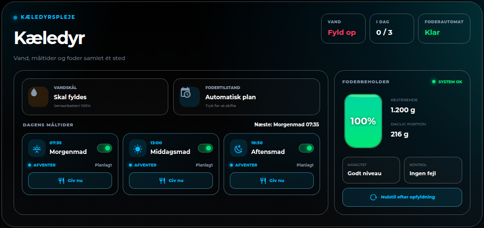

# HA Pet Care Card

Et samlet og responsivt Home Assistant-kort til kæledyrspleje, vandskål, planlagte måltider og foderautomat.



## Funktioner

- Ét overblik over vand, fodermode, måltider og beholderniveau
- Et valgfrit antal måltider, som automatisk fordeles efter den tilgængelige bredde
- Visuel status for afventende, uddelte og missede måltider
- Aktivering af måltidsplaner direkte fra kortet
- Bekræftelse før manuel fodring og nulstilling af beholder
- GUI-editor til alle entities og måltider
- Tema-variabler, responsivt layout og reduceret animation ved `prefers-reduced-motion`

## Installation via HACS

Tilføj dette repository som et brugerdefineret HACS frontend-repository, installér kortet, og genindlæs browseren. Kortets JavaScript-fil og editorfil skal ligge i samme mappe.

Manuel resource:

```yaml
url: /local/ha-pet-care-card/ha-pet-care-card.js
type: module
```

## Opsætning

Tilføj **HA Pet Care Card** fra Home Assistants kortvælger. Alle felter kan vælges i GUI-editoren. Et komplet YAML-eksempel:

```yaml
type: custom:ha-pet-care-card
title: Kæledyrspleje
pet_name: Kæledyr
icon: mdi:dog-side
animation: true
water: binary_sensor.pet_water
water_battery: sensor.pet_water_battery
feeder_mode: select.pet_feeder_mode
daily_amount: sensor.pet_food_per_day
feeder_error: binary_sensor.pet_feeder_error
container_grams: sensor.pet_food_remaining
container_percent: sensor.pet_food_percent
refill_action: script.pet_feeder_refill
meals:
  - name: Morgenmad
    time: "07:30"
    icon: mdi:weather-sunset-up
    enabled: input_boolean.pet_breakfast_enabled
    status: input_select.pet_breakfast_status
    feed_action: script.pet_feed_breakfast
```

Status-entityen for et måltid kan bruge værdierne `pending`, `done` og `missed`. Andre værdier vises som almindelig tekst. Kortet forventer, at vand- og fejl-entities er binære sensorer, at procenten ligger mellem 0 og 100, og at fodermode har valgene `schedule` og `manual`.

## Tema-variabler

Kortet følger Home Assistants standardfarver og understøtter desuden:

```yaml
dashboard-accent: "#62b5ff"
dashboard-success: "#54d9aa"
dashboard-warning: "#ffbd59"
dashboard-danger: "#ff667a"
dashboard-icon-muted: "#8390a2"
dashboard-border-neutral: "rgba(255,255,255,.11)"
dashboard-shadow-deep: "0 18px 45px rgba(0,0,0,.25)"
surface: "#142131"
```

## Sikkerhed

Manuel fodring og nulstilling af beholder viser en bekræftelsesdialog, før det valgte script køres.

## Licens

MIT
